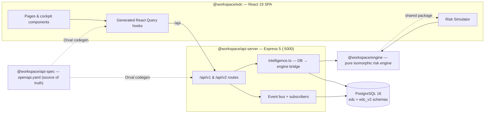

<div align="center">

# Enterprise Deal Commander (EDC)

**A single-operator executive command cockpit for enterprise software deals — it tracks a deal's technical-validation health alongside its commercial stage, flags risk with a deterministic engine, and turns a live pipeline into a boardroom-ready briefing in minutes.**

[](./LICENSE)


</div>

---

## Table of contents

- [What is EDC?](#what-is-edc)
- [The problem it solves](#the-problem-it-solves)
- [Feature highlights](#feature-highlights)
- [Architecture at a glance](#architecture-at-a-glance)
- [Tech stack](#tech-stack)
- [Quick start](#quick-start)
- [Repository structure](#repository-structure)
- [Documentation](#documentation)
- [Screenshots](#screenshots)
- [Project status & roadmap](#project-status--roadmap)
- [Contributing](#contributing)
- [License](#license)
- [Credits](#credits)

---

## What is EDC?

Enterprise Deal Commander is an **executive overlay** for a single power user — the *"Deal Commander"* — who owns the technical-validation health of a portfolio of large enterprise deals (built around the ManageEngine **AD360 / Log360** IAM & SIEM sales motion).

Traditional CRMs track the *commercial* pipeline (Discovery → Validation → Commercial → Procurement → Closed). EDC runs a **parallel technical track** — a 9-point gate matrix — against that pipeline, and continuously reconciles the two. When the sales line races ahead of the technical reality, EDC flags it. When a deal is quietly dying, EDC surfaces it. When it's time to brief the C-suite, EDC turns the whole portfolio into a projector-ready **Executive Briefing / War Room** view.

It ships in two conceptual editions governed by an explicit [Phase Boundary Charter](./docs/roadmap.md):

- **Phase 1 — "Executive War Room Edition":** a correct, deterministic, self-contained, in-the-moment deal recorder and risk cockpit.
- **Phase 2 — "Sovereign Intelligence Edition":** predictive scoring, cohort benchmarking, persisted history, competitive & deal memory, automation, and multi-commander collaboration.

## The problem it solves

> Large-scale Total Contract Value (TCV) pipelines fail not from a lack of sales activity, but from a **disconnect between commercial progression and technical validation.**

CRMs prioritize the sales forecast and leave leadership blind to un-scoped Proofs of Concept, architecture vetoes, and premature commercial pushes. EDC exists to close that gap:

- **One source of truth** — one Commander, one authenticated session, zero data drift.
- **Technical-vs-commercial alignment** — surfaces the exact gap CRMs ignore.
- **Compound risk visibility** — a deterministic, explainable engine; the worst active signal drives the health color.
- **Presentation-grade output** — every screen is designed to be projected in a boardroom without modification.

The headline goal: cut executive-review prep from *45+ minutes in spreadsheets* to *under 5 minutes.*

## Feature highlights

**Phase 1 (core cockpit)**
- 📊 **Deal cockpit** — economics (multi-currency **normalized TCV**), the 9-point technical gate matrix, blockers, and cross-sell whitespace on one screen.
- 🧠 **Intelligence engine** — 15 deterministic risk patterns **plus** a 7-dimension composite **Risk Engine v2**, each alert **glass-box explainable** (inputs, thresholds-with-provenance, and a static "clears when" remediation).
- 🚦 **Stage-transition guardrails** — advancing past an active RED risk returns `409 STAGE_GUARDRAIL` unless the Commander supplies a typed override (recorded to an audit ledger).
- 🗂️ **Risk governance** — acknowledge / accept / snooze any alert with a required rationale; disposed alerts become "Managed Risk."
- 🎬 **Executive Briefing / War Room mode** — curated agenda, private speaker notes, pacing timer, and a client-side **Risk Simulator** for ephemeral what-if analysis.
- 🩺 **Closed-Lost autopsy**, **portfolio correlation**, **soft-delete / archive / restore**, and a 48-hour signed **Bat-Signal** share link.

**Phase 2 (sovereign intelligence)**
- 🔮 Predictive deal scoring, velocity & pipeline analytics, Monte-Carlo forecasting.
- 🏆 Competitive intelligence, **Deal Memory** knowledge hub, win/loss post-mortems.
- 🤖 Custom risk-pattern builder, automated playbooks / next-best-action, escalation chains, natural-language command parsing.
- 👥 Multi-commander delegation, stakeholder influence mapping, decision log.
- 📈 Pipeline **Flow Analytics** (funnel, conversion matrix, Sankey transitions), board-ready reports, and a durable time-series history backbone.

See [`docs/overview.md`](./docs/overview.md) for the full, verified feature catalog.

## Architecture at a glance

EDC is a **contract-first, isomorphic-engine** pnpm monorepo. The same pure risk engine runs on the server *and* in the browser, so simulated and live risk results never diverge.



Full detail, with data-flow and event-bus diagrams, is in [`docs/architecture.md`](./docs/architecture.md).

## Tech stack

| Layer | Technology |
|---|---|
| Language / tooling | TypeScript 5.9, Node 24, **pnpm** workspace (pnpm-only), Prettier |
| Frontend | React 19, Vite 7, Tailwind CSS v4, shadcn/ui (Radix), TanStack Query, `wouter`, Recharts, Framer Motion, PWA (Workbox) |
| Backend | Express 5, `pino` logging, `jsonwebtoken` (HS256) + `bcryptjs`, `express-rate-limit`, esbuild bundling |
| Data | PostgreSQL 16 via **Drizzle ORM** (`edc` + `edc_v2` schemas), `pg` |
| Contract & codegen | OpenAPI 3.1 (`openapi.yaml`) → **Orval** → typed React Query hooks + Zod validators |
| Intelligence | Pure isomorphic `@workspace/engine` (15 risk patterns + 7-dimension Risk Engine v2) |
| Testing | Vitest |

## Quick start

> Prerequisites: **Node 24**, **pnpm**, and **PostgreSQL 16**. Full details in [`docs/installation.md`](./docs/installation.md).

```bash
# 1. Install dependencies (pnpm only — npm/yarn are rejected)
pnpm install

# 2. Configure the API server env
cp artifacts/api-server/.env.example artifacts/api-server/.env
#   → set DATABASE_URL and SESSION_SECRET

# 3. Push the schema and seed data
pnpm --filter @workspace/db run push
pnpm --filter @workspace/api-server run seed

# 4. Run the API server (port 5000)
pnpm --filter @workspace/api-server run dev

# 5. In a second terminal, run the frontend (Vite)
cp artifacts/edc/.env.example artifacts/edc/.env
pnpm --filter @workspace/edc run dev
```

Then open the Vite URL and log in with the seeded Commander credentials. A step-by-step first run is in [`docs/quickstart.md`](./docs/quickstart.md).

## Repository structure

```
Deal-Commander/
├── artifacts/            # Deployable apps
│   ├── api-server/       # Express 5 API (@workspace/api-server)
│   ├── edc/              # React SPA (@workspace/edc)
│   └── mockup-sandbox/   # UI playground (not part of the product)
├── lib/                  # Shared libraries
│   ├── engine/           # Pure isomorphic risk engine (@workspace/engine)
│   ├── db/               # Drizzle schema + client (@workspace/db)
│   ├── api-spec/         # openapi.yaml + Orval config (@workspace/api-spec)
│   ├── api-zod/          # Generated Zod validators
│   └── api-client-react/ # Generated React Query hooks
├── scripts/              # Maintenance scripts (tsx)
├── docs/                 # 📖 This documentation set (+ product PRDs)
├── attached_assets/      # Original product requirement documents
└── .agents/memory/       # Engineering gotcha notes
```

A fully annotated tree is in [`docs/directory-structure.md`](./docs/directory-structure.md).

## Documentation

Start at the **[documentation index → `docs/README.md`](./docs/README.md)**. Highlights:

| Topic | Doc |
|---|---|
| What EDC is, features, personas | [overview.md](./docs/overview.md) |
| System design & data flow | [architecture.md](./docs/architecture.md) |
| Install & prerequisites | [installation.md](./docs/installation.md) |
| First run | [quickstart.md](./docs/quickstart.md) |
| Config & environment variables | [configuration.md](./docs/configuration.md) |
| Build & deployment | [build-and-deploy.md](./docs/build-and-deploy.md) |
| Using the app | [usage.md](./docs/usage.md) |
| REST API (v1 + v2) | [api-reference.md](./docs/api-reference.md) |
| The intelligence engine | [risk-engine.md](./docs/risk-engine.md) |
| Database schema | [data-model.md](./docs/data-model.md) |
| Troubleshooting & FAQ | [troubleshooting.md](./docs/troubleshooting.md) |
| Security | [security.md](./docs/security.md) |
| Contributing & dev setup | [../CONTRIBUTING.md](./CONTRIBUTING.md) · [development.md](./docs/development.md) |
| Glossary | [glossary.md](./docs/glossary.md) |
| Roadmap & product docs | [roadmap.md](./docs/roadmap.md) · [product/](./docs/product/) |

## Screenshots

> 📸 _Screenshot placeholders — replace with real captures once the stack is running (see [`docs/usage.md`](./docs/usage.md))._

| View | Placeholder |
|---|---|
| Dashboard (Pipeline Vital Signs) | `docs/assets/dashboard.png` |
| Deal Cockpit (gates + risk) | `docs/assets/deal-cockpit.png` |
| Executive Briefing / War Room | `docs/assets/briefing-mode.png` |
| Risk Radar (Risk Engine v2) | `docs/assets/risk-radar.png` |

## Project status & roadmap

EDC is under active development (no tagged releases yet; version pinned at `0.0.0`). Phase 1 is functionally complete; large parts of Phase 2 (Risk Engine v2, durable history, Deal Memory, Pipeline Flow Analytics, settings backend, Deal Roster/Kanban) have shipped. A migration to **Zoho Catalyst** is a planned future step. See [`docs/roadmap.md`](./docs/roadmap.md) and [`CHANGELOG.md`](./CHANGELOG.md).

## Contributing

Contributions are welcome — please read [`CONTRIBUTING.md`](./CONTRIBUTING.md) and the [`CODE_OF_CONDUCT.md`](./CODE_OF_CONDUCT.md) first. In short: pnpm only, keep the OpenAPI spec the source of truth (regenerate; never hand-edit generated code), and run `pnpm run typecheck` before you push.

## License

Released under the [MIT License](./LICENSE). Copyright (c) 2026 Zoho Corporation.

## Credits

Built as the Enterprise Deal Commander initiative. Product direction is captured in the Phase 1 & Phase 2 PRDs and the proposals under [`docs/product/`](./docs/product/). See [`docs/credits.md`](./docs/credits.md).
