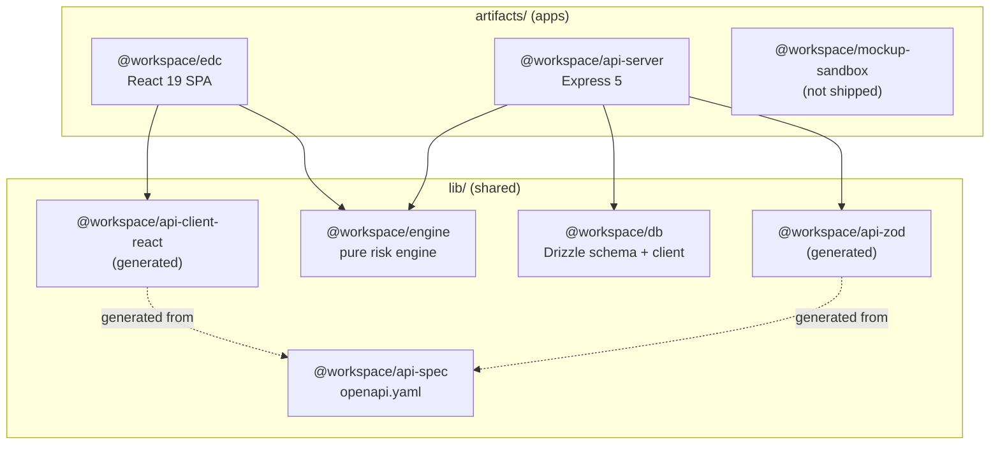
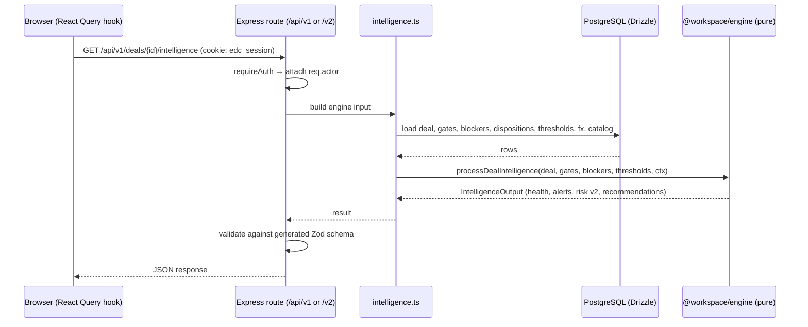
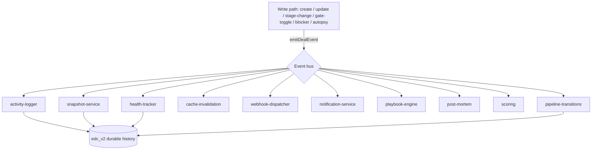
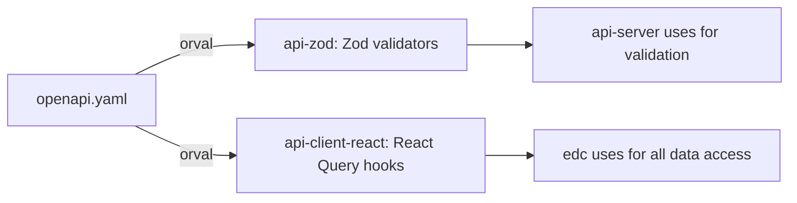

# Architecture

- [Design principles](#design-principles)
- [Monorepo package graph](#monorepo-package-graph)
- [The packages](#the-packages)
- [Request → engine data flow](#request--engine-data-flow)
- [The event bus (Phase 2)](#the-event-bus-phase-2)
- [Contract-first codegen](#contract-first-codegen)
- [Authentication & session model](#authentication--session-model)
- [Key invariants](#key-invariants)

## Design principles

EDC is built on three deliberate architectural decisions:

1. **Contract-first.** `lib/api-spec/openapi.yaml` is the single source of truth for the HTTP
   API. Both the server's request/response validators (Zod) and the client's data hooks (React
   Query) are **generated** from it via [Orval](https://orval.dev). Drift between client and
   server is structurally impossible.
2. **Isomorphic, pure engine.** All risk logic lives in `lib/engine`, which performs **no
   database or network calls**. Every input (thresholds, FX rate, catalog size, momentum
   context, dispositions, stakeholders, competitors) is passed in as an argument. The *identical*
   function therefore runs on the server (authoritative results) and in the browser (the Risk
   Simulator and historical Briefing replay), so simulated and live risk can never diverge.
3. **Deterministic core, event-driven periphery.** Phase 1 is strictly request/response with no
   background infrastructure. Phase 2 adds an **in-process event bus** whose subscribers build
   durable history and invalidate caches — but subscriber failures can never break the request
   path.

## Monorepo package graph



## The packages

| Package | Path | Responsibility |
|---|---|---|
| `@workspace/engine` | `lib/engine` | Pure, isomorphic intelligence engine — risk patterns, Risk Engine v2 dimensions, scoring, simulation, custom patterns, ramp pricing, NLC parsing, flow analytics, loss-risk. No build step; exported from `src/index.ts`. |
| `@workspace/db` | `lib/db` | Drizzle ORM schema (`src/schema/*`) and the `pg` pool client. Two Postgres schemas: `edc` (Phase 1) and `edc_v2` (Phase 2 durable history + intelligence). |
| `@workspace/api-spec` | `lib/api-spec` | `openapi.yaml` (the API contract) and the Orval codegen config. |
| `@workspace/api-zod` | `lib/api-zod` | **Generated** Zod validators used server-side. |
| `@workspace/api-client-react` | `lib/api-client-react` | **Generated** typed React Query hooks used client-side. |
| `@workspace/api-server` | `artifacts/api-server` | Express 5 API on port 5000. Routes, the DB→engine bridge (`intelligence.ts`), the event bus, and (optionally) serving the built SPA. |
| `@workspace/edc` | `artifacts/edc` | React 19 + Vite + Tailwind v4 + shadcn/ui frontend — the product UI. |
| `@workspace/mockup-sandbox` | `artifacts/mockup-sandbox` | Isolated UI mockup playground. **Not part of the product.** |
| `@workspace/scripts` | `scripts` | Maintenance scripts (backfill, single-bundle build) run with `tsx`. |

Workspace globs (`pnpm-workspace.yaml`): `artifacts/*`, `lib/*`, `lib/integrations/*`, `scripts`.

## Request → engine data flow

Every read that involves risk follows the same path. The server assembles a plain-data input
from Drizzle and hands it to the pure engine.



The exact same `processDealIntelligence` function is imported directly by the browser for the
Risk Simulator, so a "what-if" preview is computed with identical logic — no server round trip
and no divergence.

## The event bus (Phase 2)

Phase 2 introduces an in-process typed event bus (`artifacts/api-server/src/lib/events.ts`,
a Node `EventEmitter` — **no Redis or external queue**). After a successful mutation, Phase 1
write paths publish a domain event; subscribers react asynchronously.



Events include `deal.created / updated / stage_changed / deleted / restored / archived`,
`gate.toggled`, `blocker.created / resolved`, `health.changed`, and `deal.autopsy_captured`.
`emitDealEvent` **swallows subscriber errors** so a failing subscriber can never break the HTTP
request. The server also runs periodic jobs: an hourly snapshot service, a ~15-minute
materialized-view refresh, and a portfolio-rollup warm-up.

> Read `.agents/memory/edc-phase2-backbone.md` and `edc-cache-generation-guard.md` before
> modifying the bus, cache, or history tables.

## Contract-first codegen



Regenerate after any contract change:

```bash
pnpm --filter @workspace/api-spec run codegen
```

**Never** hand-edit files under `src/generated/**`, and **never** change `info.title` in the
spec (it drives the generated filenames).

## Authentication & session model

- **Cookie session.** On login the server issues an **HS256 JWT** signed with `SESSION_SECRET`,
  stored in an `edc_session` cookie (`httpOnly`, `sameSite: lax`, `secure` in production, 7-day
  TTL). Passwords are hashed with **bcrypt**.
- **Login quirk:** the login field is named `email` but maps to `commanders.username`.
- `requireAuth` middleware validates the cookie and attaches `req.actor`; all `/api/v2` routes
  and most `/api/v1` routes require it. The public exceptions are `POST /v1/auth/login`,
  `GET /healthz`, and the Bat-Signal share endpoint `GET /v1/share/{token}`.

## Key invariants

These behaviors are load-bearing — preserve them when changing code:

- **Stage guardrail.** Advancing past an active RED risk returns `409 STAGE_GUARDRAIL` unless an
  `override_reason` is provided; overrides are persisted to `deal_stage_overrides` and audited.
- **Audit-driven snapshots.** The audit log carries `entity_id` (e.g. a gate code) so
  point-in-time snapshots can reconstruct historical gate state. Snapshots reconstruct **gates
  only** — economics and stage always reflect current values.
- **Express route ordering.** Literal paths (`/gates/batch`) must be registered before param
  paths (`/gates/:gateCode`).
- **Deal update on PUT and PATCH.** The handler is registered on both; the generated client uses
  PUT.
- **Governance health = composite risk level.** Health (RED/YELLOW/GREEN) is derived from Risk
  Engine v2's composite level, not the legacy pattern-weight roll-up. RED patterns still gate
  stage advancement independently. See [risk-engine.md](./risk-engine.md).
