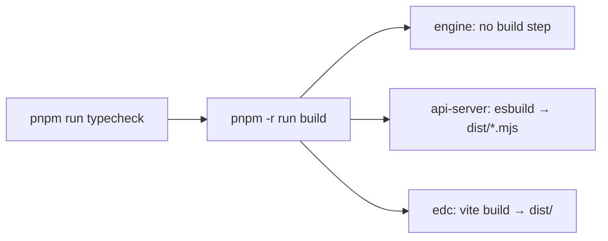

# Build & Deployment

- [Build overview](#build-overview)
- [Typecheck](#typecheck)
- [Building each package](#building-each-package)
- [API server build (esbuild)](#api-server-build-esbuild)
- [Frontend build (Vite)](#frontend-build-vite)
- [Code generation (Orval)](#code-generation-orval)
- [Single-origin bundle](#single-origin-bundle)
- [Deployment](#deployment)
- [Planned: Zoho Catalyst](#planned-zoho-catalyst)

## Build overview

The root build orchestrates a typecheck followed by a recursive per-package build:

```bash
pnpm run build
# = pnpm run typecheck && pnpm -r --if-present run build
```



## Typecheck

```bash
pnpm run typecheck
# typecheck:libs → tsc --build (project references over lib/db, lib/engine, lib/api-*)
# then per-artifact + scripts → tsc --noEmit
```

Always run this before claiming a change compiles. It is the fastest full-repo correctness gate.

## Building each package

| Package | Command | Output |
|---|---|---|
| `@workspace/engine` | (none) | Pure TS, consumed directly — no build step. |
| `@workspace/api-server` | `pnpm --filter @workspace/api-server run build` | `dist/index.mjs`, `dist/seed.mjs` (esbuild) |
| `@workspace/edc` | `pnpm --filter @workspace/edc run build` | `dist/` static SPA (Vite) |
| `@workspace/api-zod`, `@workspace/api-client-react` | via codegen | `src/generated/**` |

## API server build (esbuild)

`artifacts/api-server/build.mjs` bundles `src/index.ts` and `src/seed.ts` into a single ESM file
each under `dist/` (`.mjs`). Key characteristics:

- **Workspace dependencies are inlined** into the bundle. This is why the `dev` script rebuilds
  on every start and why you must re-run it after editing routes, the engine, or the schema.
- A banner shims `require`/`__dirname` for the ESM output.
- A long `external` list keeps native modules out of the bundle.
- The `esbuild-plugin-pino` transport plugin is applied for structured logging.

The `dev` script = build (`node ./build.mjs`) then start (`node dist/index.mjs`).

## Frontend build (Vite)

`artifacts/edc` builds with Vite 7:

```bash
pnpm --filter @workspace/edc run build     # → dist/
pnpm --filter @workspace/edc run serve     # vite preview of the build
```

`vite.config.ts` also configures the **PWA** (manifest "Enterprise Deal Commander",
`StaleWhileRevalidate` caching of `/api/v[12]/` GETs except auth) and the dev proxy
(`/api` → `API_PROXY_TARGET`, default `http://localhost:5000`).

## Code generation (Orval)

The API client and validators are generated, not hand-written:

```bash
pnpm --filter @workspace/api-spec run codegen
```

Run this after **any** change to `lib/api-spec/openapi.yaml`. It regenerates `@workspace/api-zod`
and `@workspace/api-client-react`, then re-typechecks the libs. Do not hand-edit
`src/generated/**`, and do not change `info.title` in the spec.

## Single-origin bundle

For hosting the whole product behind one origin/port, the SPA can be built and served by the
Express process:

- `app.ts` optionally serves the built SPA from `dist/public` with an Express-5 `/{*splat}`
  fallback (so client-side routes resolve).
- `scripts/build-single.ts` and `scripts/post-merge.sh` support producing the single bundle
  (the built SPA is copied into the API server's `dist/public`).

In that mode you set the frontend `BASE_PATH` to the sub-path the app is mounted at.

## Deployment

There is **no Dockerfile or CI-driven deploy** committed to the repo. Historically the app was
built and hosted on **Replit** (each artifact has a `.replit-artifact/` directory). A generic
production deployment looks like:

1. Provision **PostgreSQL 16** and set `DATABASE_URL`.
2. Set `SESSION_SECRET` (required) and `NODE_ENV=production`.
3. `pnpm install --frozen-lockfile`
4. Apply the schema (`pnpm --filter @workspace/db run push`, or your migration mechanism) and
   seed lookups.
5. Build: `pnpm run build` (and the single-origin bundle if you want one port).
6. Run the API server (`node artifacts/api-server/dist/index.mjs`) behind a reverse proxy with
   TLS. In production, session cookies are `Secure`, so serve over HTTPS.

A starter GitHub Actions CI (`.github/workflows/ci.yml`) runs install → typecheck → build →
tests; it is scaffolding you can extend into a deploy pipeline.

## Planned: Zoho Catalyst

A migration to **Zoho Catalyst** (serverless functions + hosted data) is a planned future step.
No Catalyst deployment configuration exists in the repo yet. Favor port-friendly, stateless
choices in new code to keep that migration smooth. See [roadmap.md](./roadmap.md).
