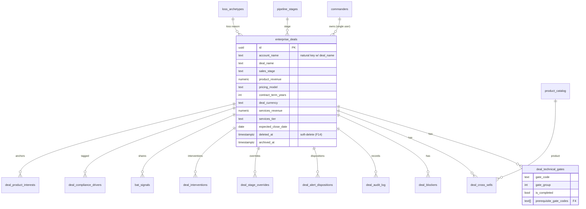

# Data Model

EDC uses **Zoho Catalyst Data Store** — a hosted, schemaless Row API, not a SQL database. All 71
tables live in one flat namespace (Phase 2 tables carry a `v2_` prefix instead of a separate
schema). See [`docs/CATALYST_SCHEMA.md`](./CATALYST_SCHEMA.md) for the authoritative
table-by-table manifest and type mapping, and
[`docs/catalyst-datastore-constraints.md`](./catalyst-datastore-constraints.md) for the Row
API's real constraints (no `WHERE` clause, no native FK cascade, second-granularity datetimes).

> **ID fields.** This doc's ER diagram below still shows ID columns as `uuid` for readability —
> in the real Data Store schema every one of those is a `varchar(36)` populated with
> `crypto.randomUUID()` at write time, not a database-generated default. See
> [`docs/CATALYST_SCHEMA.md`](./CATALYST_SCHEMA.md) for the full type mapping.

- [Core entities (ER diagram)](#core-entities-er-diagram)
- [Phase 1 tables (`edc`)](#phase-1-tables-edc)
- [Phase 2 tables (`edc_v2`)](#phase-2-tables-edc_v2)
- [Settings tables](#settings-tables)
- [Conventions & notes](#conventions--notes)

## Core entities (ER diagram)

The Phase 1 heart of the model: a deal, its technical gates, blockers, cross-sells, and the
governance artifacts around it.

```mermaid
erDiagram
    commanders ||--o{ enterprise_deals : "owns (single user)"
    enterprise_deals ||--o{ deal_technical_gates : has
    enterprise_deals ||--o{ deal_cross_sells : has
    enterprise_deals ||--o{ deal_blockers : has
    enterprise_deals ||--o{ deal_audit_log : records
    enterprise_deals ||--o{ deal_alert_dispositions : dispositions
    enterprise_deals ||--o{ deal_stage_overrides : overrides
    enterprise_deals ||--o{ deal_interventions : interventions
    enterprise_deals ||--o{ bat_signals : shares
    enterprise_deals ||--o{ deal_compliance_drivers : tagged
    enterprise_deals ||--o{ deal_product_interests : anchors
    pipeline_stages ||--o{ enterprise_deals : "stage"
    product_catalog ||--o{ deal_cross_sells : "product"
    loss_archetypes ||--o{ enterprise_deals : "loss reason"

    enterprise_deals {
        uuid id PK
        text account_name "natural key w/ deal_name"
        text deal_name
        text sales_stage
        numeric product_revenue
        text pricing_model
        int contract_term_years
        text deal_currency
        numeric services_revenue
        text services_tier
        date expected_close_date
        timestamptz deleted_at "soft-delete (F14)"
        timestamptz archived_at
    }
    deal_technical_gates {
        text gate_code
        int gate_group
        bool is_completed
        text[] prerequisite_gate_codes "F4"
    }
```

## Phase 1 tables (`edc`)

### Identity
| Table | Purpose |
|---|---|
| `commanders` | The authenticated user(s). Identity is keyed by Catalyst's own `catalyst_user_id`, filled in on first Catalyst sign-in; `username` stores the lowercased Catalyst account email. `password_hash` is an unused legacy column — no longer read anywhere. |

### Deals & governance
| Table | Purpose |
|---|---|
| `enterprise_deals` | The central entity. Natural key `(account_name, deal_name)`. Holds economics, stage, dates, and soft-delete/archive columns (F14). |
| `deal_technical_gates` | The 9-point gate matrix per deal (gate code, group, completion, `prerequisite_gate_codes`). |
| `deal_cross_sells` | Cross-sell products and their pitched state (F13). |
| `deal_compliance_drivers` | Compliance drivers attached to a deal (SOX, HIPAA, PCI-DSS, …). |
| `deal_product_interests` | Anchor products the deal is built around. |
| `deal_blockers` | Blockers with category and severity. |
| `deal_audit_log` | **Immutable** change log; carries `entity_id` so snapshots can reconstruct historical gate state. |
| `deal_alert_dispositions` | Acknowledge / accept / snooze records per pattern (F3). |
| `deal_review_markers` | "Reviewed" markers on deals. |
| `deal_interventions` | Rapid-intervention checklist launches (F7). |
| `deal_stage_overrides` | Ledger of typed overrides when a RED guardrail was bypassed (F12). |
| `bat_signals` | 48-hour signed share tokens (F7). |

### Lookups
| Table | Purpose |
|---|---|
| `pipeline_stages` | Commercial stages (Discovery → … → Closed). Stored as rows so new stages are inserts, not schema changes. |
| `pricing_models`, `services_tiers` | Economics enumerations. |
| `team_members`, `segments`, `deal_types` | Reference data (team members are soft-deletable). |
| `product_catalog` | Products available to pitch. |
| `competitors`, `competitor_battlecards` | Competitor reference data and battlecards. |
| `compliance_drivers` | Compliance-driver taxonomy. |
| `blocker_categories`, `blocker_severities` | Blocker enumerations. |
| `loss_archetypes` | Closed-Lost archetype taxonomy (F10). |
| `engine_thresholds` | Tunable engine thresholds (seeded; drive the risk patterns). |

> **FX rates** are read/written via `GET|PUT /api/v1/lookups/fx-rates` and feed multi-currency
> normalization (F1); they are stored in the lookup layer.

## Phase 2 tables (`edc_v2`)

### Durable history
| Table | Purpose |
|---|---|
| `deal_activity_log` | Append-only activity stream (written by the activity-logger subscriber). |
| `deal_snapshots` | Hourly point-in-time snapshots; payload `{deal, gates, governance}`. |
| `deal_health_history` | Health-color time series (health-tracker subscriber). |
| `portfolio_rollups` | **Unused since 2026-08** — the precompute it backed was removed (aggregates are computed live). The table definition is retained but never read or written. |
| `pipeline_transitions` | Stage-transition events (pipeline-transitions subscriber) — powers Flow analytics. |
| `pipeline_targets` | Pipeline/coverage targets. |

### Intelligence
| Domain | Tables |
|---|---|
| Scoring | `deal_scores`, `scoring_model_weights`, `velocity_benchmarks` |
| Competitive | `deal_competitors` |
| Deal Memory | `deal_memory` |
| Stakeholders & decisions | `stakeholders`, `meeting_sessions`, `deal_decisions` |
| Custom patterns | `custom_risk_patterns`, `custom_pattern_conditions` |
| Playbooks | `playbooks`, `playbook_steps`, `deal_playbook_assignments`, `playbook_step_completions` |
| Financial | `deal_pricing_schedule`, `financial_scenarios` |
| Notifications | `notification_rules`, `notification_log` |
| Custom fields & tags | `custom_field_definitions`, `custom_field_values`, `tag_definitions`, `deal_tags` |
| Webhooks | `webhooks`, `webhook_delivery_log` |

## Settings tables

| Table | Purpose |
|---|---|
| `settings_change_log` | Auditable configuration changes (list / get / rollback / export). |
| `automation_rules`, `automation_actions` | Automation rule engine. |
| `automation_rule_templates` | Reusable rule templates. |
| `automation_execution_log` | Automation run history. |

## Conventions & notes

- **Isomorphic input, not repository objects, feed the engine.** `intelligence.ts` reads these
  tables via the Catalyst repositories and builds the plain-data input the pure engine expects —
  the engine never touches Data Store directly.
- **Snapshots reconstruct gates only.** Economics and stage always reflect current values; only
  gate state is rebuilt from the audit log for point-in-time views.
