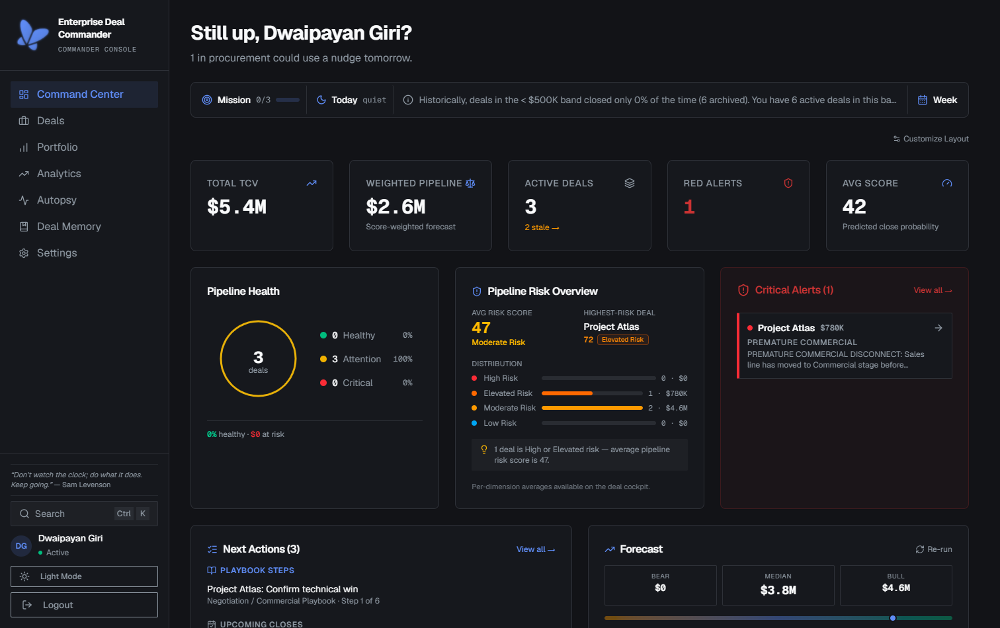
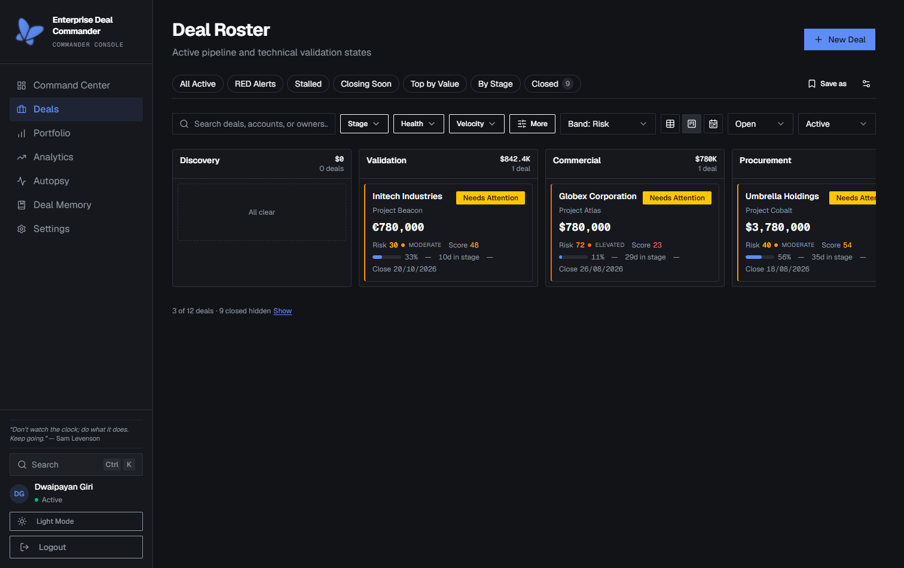
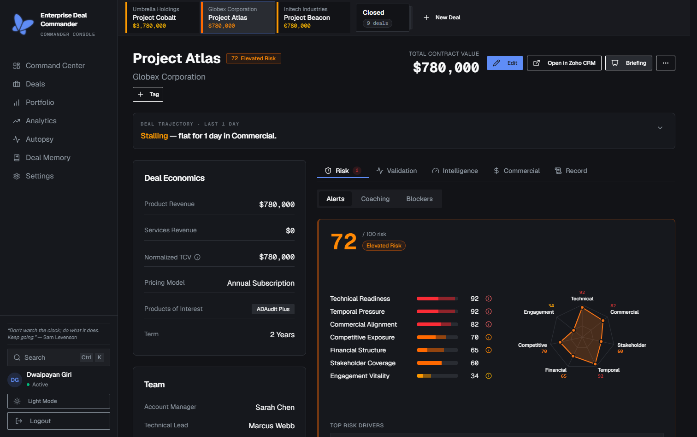
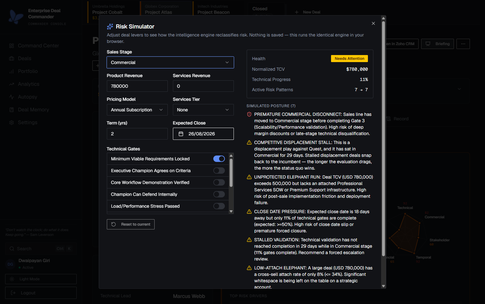
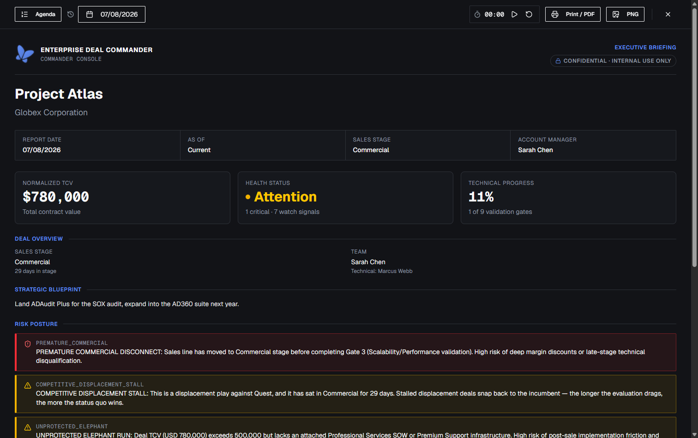
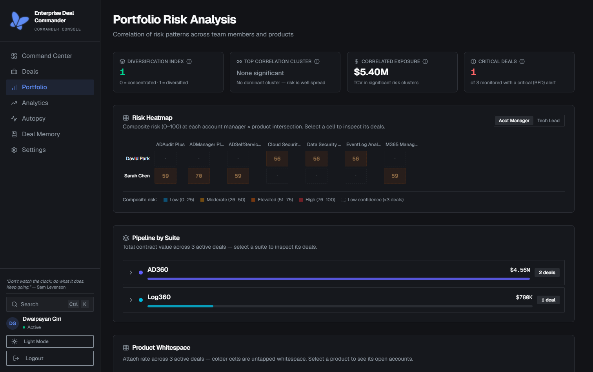
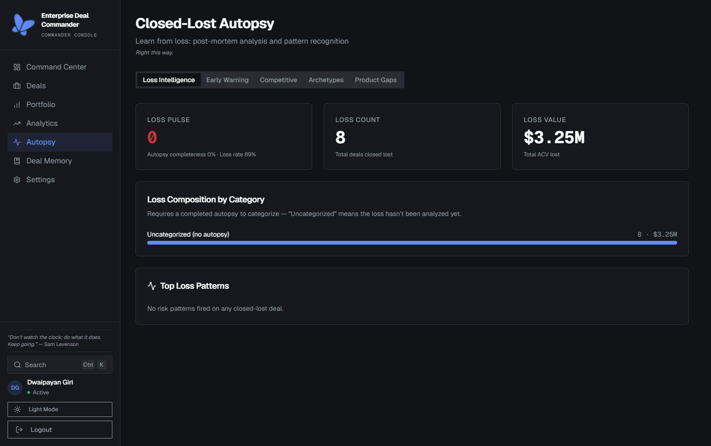
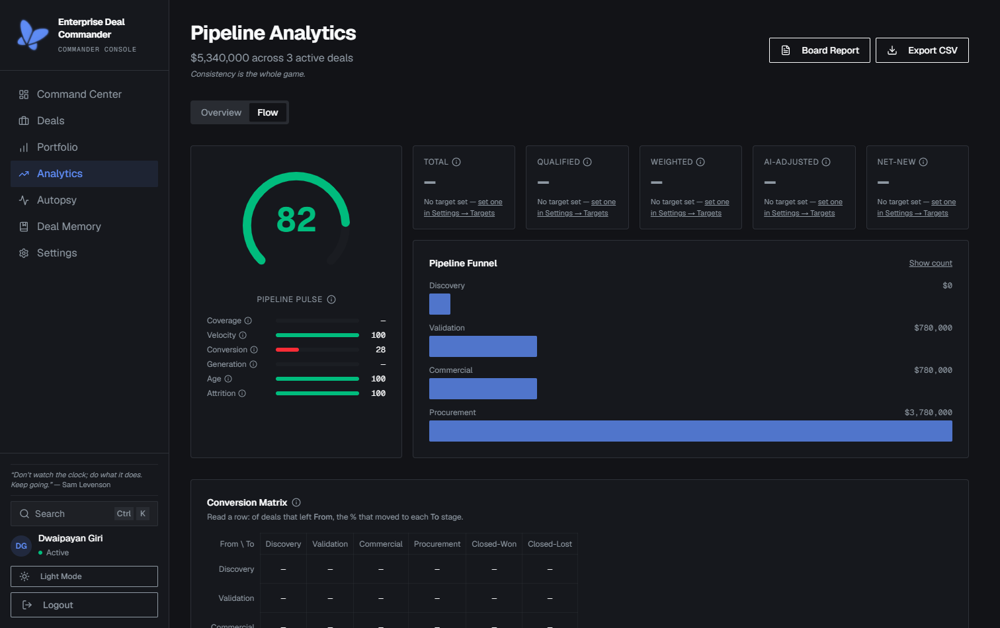
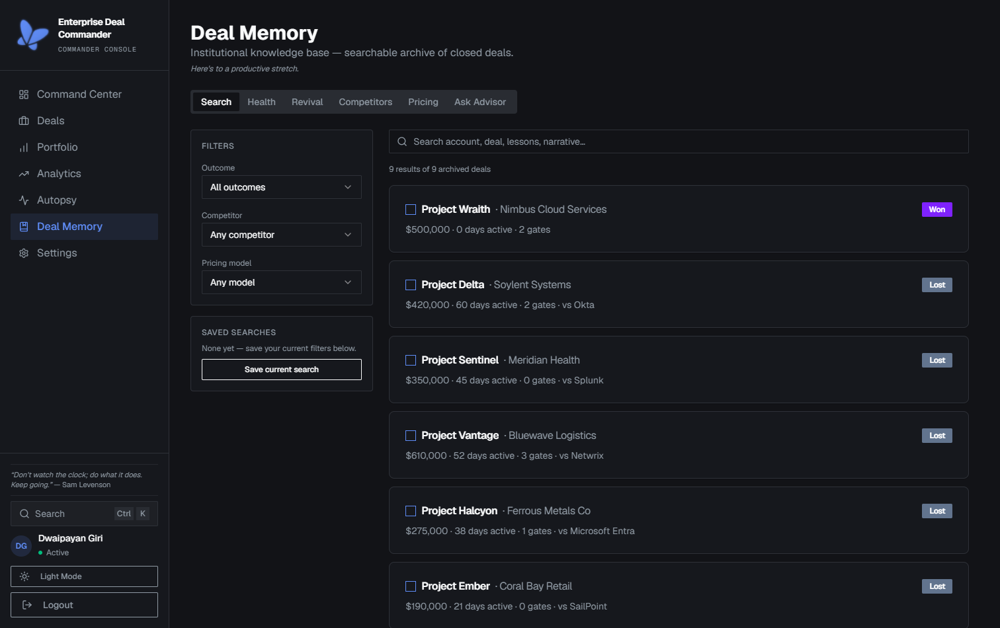
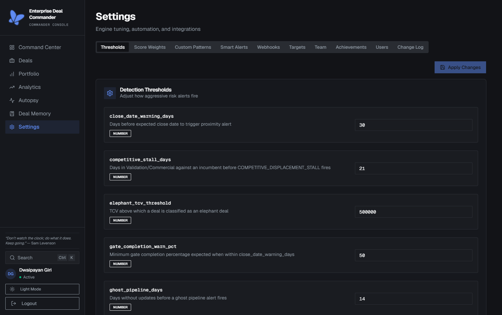

# User Manual

**Enterprise Deal Commander (EDC)** is a single-operator "command cockpit" for managing the
health of large enterprise software deals: it layers a technical-validation track on top of the
commercial pipeline and runs a deterministic risk engine over both, rolling every deal up to a
single GREEN / YELLOW / RED health color. This manual is for the people who **use** EDC —
Commanders working deals day to day, and admins configuring the engine, tuning access, and
running maintenance tasks. If you're setting up a local development environment or working on
EDC's own code, read [`development.md`](./development.md) instead.

- [What EDC is](#what-edc-is)
- [Getting started](#getting-started)
- [Screen-by-screen guide](#screen-by-screen-guide)
- [Admin](#admin)
- [FAQ & troubleshooting](#faq--troubleshooting)

## What EDC is

### Executive summary

**Enterprise Deal Commander (EDC)** is a single-operator "command cockpit" for managing the
health of large enterprise software deals. It is purpose-built around the ManageEngine
**AD360 / Log360** identity (IAM) and security-information (SIEM) sales motion.

Where a CRM tracks the *commercial* pipeline, EDC layers a **parallel technical-validation
track** on top of it and continuously reconciles the two. A deterministic intelligence engine
watches every deal for risk conditions — a sales stage that has raced ahead of technical
proof, a proof-of-concept with no agreed success criteria, a mega-deal with no services
attached — and rolls each deal up to a single **GREEN / YELLOW / RED** health color. The whole
portfolio can then be projected in a boardroom as an **Executive Briefing** with zero
reformatting.

EDC is deliberately **single-user** in its foundational form: one authenticated *Deal
Commander* with full control over the data, "one Commander, one authenticated session, zero
data drift."

### The problem

In the product's own framing:

> Large-scale Total Contract Value (TCV) pipelines fail not from a lack of sales activity, but
> from a **disconnect between commercial progression and technical validation.**

Traditional CRMs (Salesforce, HubSpot) optimize for the sales forecast. They record which
commercial stage a deal is in, but they are blind to:

- **Un-scoped Proofs of Concept** that drag on with no exit criteria.
- **Architecture vetoes** and InfoSec blockers that will kill a deal late.
- **Premature commercial pushes** — moving to "Commercial / Procurement" before the technology
  has actually been validated.

The result is forecast surprises, margin-destroying discounts to rescue late deals, and
post-sale churn from under-deployed customers. EDC's thesis is that these failures are
*detectable in advance* if you track the technical track as rigorously as the commercial one.

### What EDC does

1. **Records each deal on two tracks.** Commercial stage (Discovery → Validation → Commercial →
   Procurement → Closed-Won/Lost) *and* a 9-point technical **gate matrix** grouped into gate
   groups / milestones (criteria locked → MVP validated → scalability confirmed → InfoSec
   cleared → technical win signed).
2. **Computes deal economics.** Total Contract Value with multi-currency **normalization** into
   a single reporting currency, services attachment, and cross-sell whitespace/attach-rate.
3. **Runs a deterministic risk engine.** 15 named risk patterns plus a 7-dimension composite
   **Risk Engine v2**; each alert is **glass-box explainable** (the exact inputs, the thresholds
   used and whether they were tuned, and a plain-English "clears when"). See
   [risk-engine.md](./risk-engine.md).
4. **Governs risk.** The Commander can acknowledge / accept / snooze any alert with a mandatory
   rationale; the action is written to an immutable audit log and the alert becomes "Managed
   Risk."
5. **Guards stage transitions.** Advancing a deal past an active RED-triggering risk returns
   `409 STAGE_GUARDRAIL` unless the Commander supplies a typed override reason (recorded).
6. **Presents to executives.** A curated Executive Briefing / War Room mode with speaker notes,
   a pacing timer, and a client-side Risk Simulator for ephemeral what-if analysis.
7. **Remembers and analyzes** (Phase 2). Durable history, predictive scoring, pipeline flow
   analytics, competitive intelligence, and an institutional Deal Memory knowledge base.

### Who it's for (personas)

| Persona | Role in EDC |
|---|---|
| **Deal Commander** | The **only** authenticated CRUD user — a Presales Enterprise Manager who owns technical-validation health and updates records during strategic deep-dives. The primary user. |
| **Account Manager** | Sales-line owner of commercial progression. Referenced on each deal, but **does not log in** to EDC. |
| **Technical Lead** | Presales-line owner of architecture validation. Referenced on each deal, but **does not log in**. |
| **C-suite executives** | The **audience** for the Executive Briefing output — not users of the tool. |
| **RevOps / technical operators** | (Phase 2) Configure and tune the platform's parameters via the settings layer. |

Phase 2 expands the actor model to **Regional Commander**, **Global Commander / Superuser**,
and **Deal Delegate** (temporary edit access, e.g. vacation coverage), motivated by the fact
that a single person bottlenecks at roughly 15–20 active deals.

### The two-phase product model

EDC is governed by an explicit **Phase Boundary & Non-Overlap Charter** (embedded in both
PRDs). The governing principle:

> **Phase 1 = correct, deterministic, self-contained, in-the-moment.**
> **Phase 2 = predictive, cohort-benchmarked, persisted, narrative, automated, multi-actor,
> event-driven.**

The litmus test for where a capability belongs:

- Needs history beyond a single deal's own audit log? A persisted model/score/scenario?
  Delivery / escalation / notification? Auto-assignment or lifecycle automation? → **Phase 2.**
- Deterministic, single-deal (or current cross-section), and ephemeral/recoverable? → **Phase 1.**

See [roadmap.md](./roadmap.md) for what has actually shipped versus what remains proposed.

### Feature catalog

#### Phase 1 — "Executive War Room Edition"

Foundational assets plus 14 carved enhancements (F1–F14):

| Feature | Summary |
|---|---|
| Technical gate matrix | 9-point verifiable validation milestones, grouped into gate groups |
| Risk pattern engine | Deterministic, engineer-defined patterns; worst active signal drives health |
| Executive Briefing Mode | Boardroom-ready presentation overlay |
| Immutable audit log | Every mutation recorded with `entity_id` for point-in-time reconstruction |
| **F1** Multi-currency normalization | FX rates → one reporting currency → `normalizedTCV` |
| **F2** Glass-box explainable alerts | `explain()` on every pattern: inputs, thresholds-with-provenance, `clearsWhen` |
| **F3** Risk advisory governance | Acknowledge / Accept / Snooze with required rationale + audit |
| **F4** Gate dependency & integrity | Declarative prerequisites + out-of-order/regression warnings (non-blocking) |
| **F5** Presenter-grade briefing ergonomics | Agenda queue, private speaker notes, pacing timer |
| **F6** Temporal intelligence | Change Digest + Deal Replay, as read-time projections of the audit log |
| **F7** Rapid intervention checklists + Bat-Signal | Static checklists per alert + 48h read-only share link |
| **F8** Self-referential momentum | `SLOW_MOTION_COLLISION` — a deal's own gate velocity vs its own close date |
| **F9** Ephemeral risk simulator | Client-side what-if; previews health + alerts only, never persisted |
| **F10** Closed-Lost structured autopsy | Loss archetype taxonomy + deterministic correlation |
| **F11** Portfolio correlation dashboard | Current-state cross-section by AM / TL / product |
| **F12** Stage-transition guardrails | `409 STAGE_GUARDRAIL` on RED transitions unless overridden |
| **F13** Cross-sell whitespace & attach-rate | `LOW_ATTACH_ELEPHANT` pattern |
| **F14** Soft-delete, archive & restore | Recoverable deletion lifecycle |

#### Phase 2 — "Sovereign Intelligence Edition"

Grouped into six themes:

- **Deep intelligence:** predictive deal scoring, velocity & pipeline analytics, competitive
  intelligence, Deal Memory knowledge base, win/loss post-mortems.
- **Collaboration:** multi-commander access & delegation, stakeholder influence mapping,
  decision log & meeting intelligence.
- **Automation & AI:** custom risk-pattern builder, automated playbooks / next-best-action,
  natural-language command interface, smart alerts with escalation chains.
- **Financial modeling:** ramp/per-year pricing, financial scenario engine, Monte-Carlo
  pipeline simulation.
- **Executive communication:** board-ready PDF reports, Briefing Mode V2, scheduled email
  digests.
- **Platform:** custom fields/tags, import/export, webhook & integration framework, mobile PWA,
  and the durable event-driven backbone (`edc_v2` schema, event bus, caching).

The verified, shipped subset is detailed in [roadmap.md](./roadmap.md).

### Success metrics

From the Phase 1 PRD, the target outcomes are:

- Executive-review prep time: **from 45+ minutes to under 5 minutes.**
- **100%** technical-gate tracking coverage across active deals.
- Same-day flagging of **≥80%** of premature commercial pushes.

### Related reading

- [Architecture](./architecture.md) — how the pieces fit together.
- [The risk engine](./risk-engine.md) — the analytical core.
- [Glossary](./glossary.md) — precise definitions of every term used above.

## Getting started

EDC's login is Zoho Catalyst's **embedded authentication** widget on `/login` — you sign in
directly against Zoho's identity servers, there's no separate EDC password to set and no
signup form to fill out.

There is no self-serve signup. Either:

- an admin has already invited your email address (see [Admin → User management &
  RBAC](#admin)), and your account activates the first time you sign in through that widget, or
- you're the very first person to ever sign in to a fresh EDC instance, in which case you become
  its first admin automatically.

Once you're signed in, you land on the [Dashboard](#dashboard) — the portfolio's landing
decision surface — and everything below in the [Screen-by-screen guide](#screen-by-screen-guide)
is reachable from there.

Setting up a local development environment instead of just using a running instance? See
[installation.md](./installation.md).

## Screen-by-screen guide

How to use each screen of the cockpit — screen-by-screen detail and common workflows.

### Navigation map

The SPA routes (from `artifacts/edc/src/App.tsx`):

| Route | Screen | Auth |
|---|---|---|
| `/login` | Login | public |
| `/share/:token` | Bat-Signal shared risk card | public (token) |
| `/` | Dashboard | protected |
| `/deals` | Deals list / Roster | protected |
| `/deals/:id` | Deal Cockpit | protected |
| `/portfolio` | Portfolio correlation | protected |
| `/autopsy` | Closed-Lost autopsy | protected |
| `/analytics` | Analytics (velocity, pipeline, flow) | protected |
| `/memory` | Deal Memory knowledge hub | protected |
| `/memory/:id` | Deal Memory detail | protected |
| `/settings` | Settings / configuration | protected |

Protected routes are wrapped by `ProtectedRoute`, which checks the session (`/auth/me`) and is
offline-aware (the PWA keeps showing cached reads when the network drops). A **command palette**
(⌘K / Ctrl-K style) is available on every protected screen.

### Dashboard

The landing decision surface. It answers, at a glance: how much money is at stake, what's
broken, where deals are stuck, what to do next, whether the forecast is real, and what changed.
Expect a "Pipeline Vital Signs" big-numbers bar plus health, forecast, velocity and win/loss
visuals.

### Deals list & Roster

`/deals` is the page the Commander lives on — a triage surface that replaces a spreadsheet. It
supports filtering (by stage / health / velocity), saved views, an inline preview, and a
**Kanban board** where dragging a card between stages performs a stage transition (subject to the
`409` guardrail + override). Deals carry health color, per-deal risk score, forecast flags, and
score-trend arrows.

### Deal Cockpit

`/deals/:id` is the full operational workspace for a single deal. Typical panels:

- **Header / economics** — account, stage, TCV and normalized TCV, close date, win probability.
- **Technical gates** — the 9-point matrix grouped into gate groups; toggle to complete, with
  prerequisite integrity warnings.
- **Risk** — health color, pattern alerts (expandable to glass-box explanations), risk radar and
  score card across the 7 dimensions, recommended actions.
- **Blockers** — log/resolve blockers by category and severity; high-severity blockers raise
  risk.
- **Cross-sell** — pitched vs whitespace products and attach-rate; product-mix recommendations
  (next-best-product, suite bundle, recovery gap).
- **Trajectory / history** — deal trajectory, activity feed, point-in-time snapshot viewer, and
  change digest (Phase 2 / temporal features).

### Risk governance & the Simulator

- **Disposition an alert:** choose Acknowledge / Accept / Snooze and enter a required rationale.
  The alert becomes "Managed Risk" and leaves the headline critical count. Everything is audited
  and visible in the in-cockpit audit-trail viewer.
- **Risk Simulator:** a client-side, non-persisted what-if. Adjust stage/gates/economics and
  preview the resulting health and alerts. It runs the *same* engine as the server, so the
  preview matches what a real save would produce (minus persistence).

### Executive Briefing / War Room

A presentation overlay designed to be projected without reformatting:

- **Agenda queue** — curate which deals to walk through and in what order.
- **Speaker notes** — private notes that are **never projected or exported** (two export paths
  exist — an image capture and a print path — and presenter-private content is kept outside both;
  see the `briefing-export-privacy` memory note).
- **Pacing timer** — keep the review on schedule.
- **Bat-Signal** — generate a 48-hour, read-only link to one deal's risk card for a
  stakeholder who doesn't use EDC.

### Portfolio

`/portfolio` gives a current-state cross-section: which account managers, technical leads, and
products correlate with currently-triggered alerts, plus simple cycle-time views and a Pipeline
Risk Overview.

### Autopsy (Closed-Lost)

`/autopsy` is the structured loss analysis. When a deal is Closed-Lost, a **loss archetype** is
required. The autopsy view runs deterministic correlation across losses (by archetype, AM, TL,
product, competitor) so patterns in *why* deals are lost become visible.

### Analytics

`/analytics` hosts the Phase 2 analytical modules: **velocity** and **pipeline** analytics, and
the **Flow** tab — funnel, conversion matrix, Sankey stage transitions, recycle/exit analysis, a
coverage tracker, pipeline pulse, and a composite health score.

### Deal Memory

`/memory` is the institutional knowledge hub — a tabbed, faceted, highlighted search over closed
deals with detail pages (`/memory/:id`), narrative & autopsy, competitive and pricing
intelligence, playbook-effectiveness, deal comparison, and an "Ask Deal Memory" deterministic
advisor.

### Settings

`/settings` is the configuration surface: engine thresholds and dimension/model weights,
automation rules, and integrations — with an auditable change log (list / get / rollback /
export). See [configuration.md](./configuration.md). Admin-specific tasks on this screen are
covered in full in [Admin](#admin) below.

### Common workflows

| Goal | Path |
|---|---|
| Onboard a new deal | Deals → New → fill economics → start in Discovery |
| Advance a stage safely | Deal Cockpit → change stage → resolve or override any `409` guardrail |
| Clear a risk alert | Complete the action in the alert's "clears when", or disposition it with a rationale |
| Prepare a board review | Briefing mode → build agenda → add speaker notes → run the timer |
| Loop in a non-user | Deal Cockpit → Bat-Signal → share the 48h link |
| Understand a loss | Close-Lost with an archetype → Autopsy → review correlations |
| Tune the engine | Settings → adjust thresholds/weights → review change log |

## Admin

Admins get everything a Commander gets, plus the settings and user-management surfaces below.

### Settings & configuration

`/settings` is where engine thresholds and dimension/model weights, automation rules, and
integrations are tuned. Every change is written to an auditable change log — list, get, roll
back, or export it from the same screen. See [configuration.md](./configuration.md) for what
each setting controls.

### User management & RBAC

EDC has two roles: **admin** (full access) and **reader** (every read, zero writes, no
per-deal scoping — a reader sees the entire portfolio, not a subset assigned to them).

Admins invite new users by email (`POST /v1/users`); the invited person claims the pending
invite the first time they sign in through Catalyst embedded auth — there's no separate signup
step.

The server independently enforces two safety rules, regardless of what the UI allows you to
click:

- **You cannot act on your own account** — a self-demote, self-deactivate, or self-delete
  request is rejected.
- **The last active admin can never be demoted, deactivated, or deleted** — there is always at
  least one admin left standing.

See [security.md#authorization-rbac](./security.md#authorization-rbac) for the full
authorization model.

### Job Scheduling & maintenance

Seeding demo/lookup data and reconstructing pipeline-transition history are both admin-only HTTP
endpoints — operator tasks run once against a running instance, not something a day-to-day admin
reaches for during normal settings work. See [cli-and-scripts.md](./cli-and-scripts.md) for how
and when to call them.

## FAQ & troubleshooting

Running into an error, or have a question this manual didn't answer? See
[troubleshooting.md](./troubleshooting.md) for common errors, debugging tips, and FAQ.
